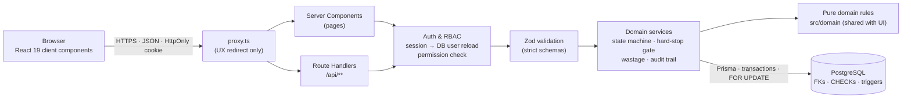
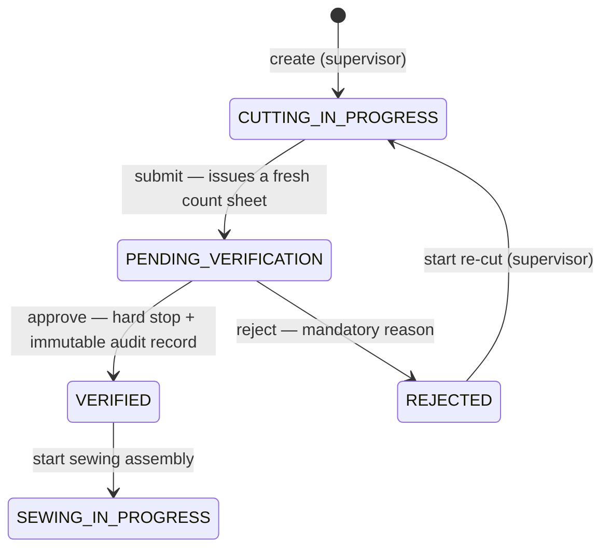
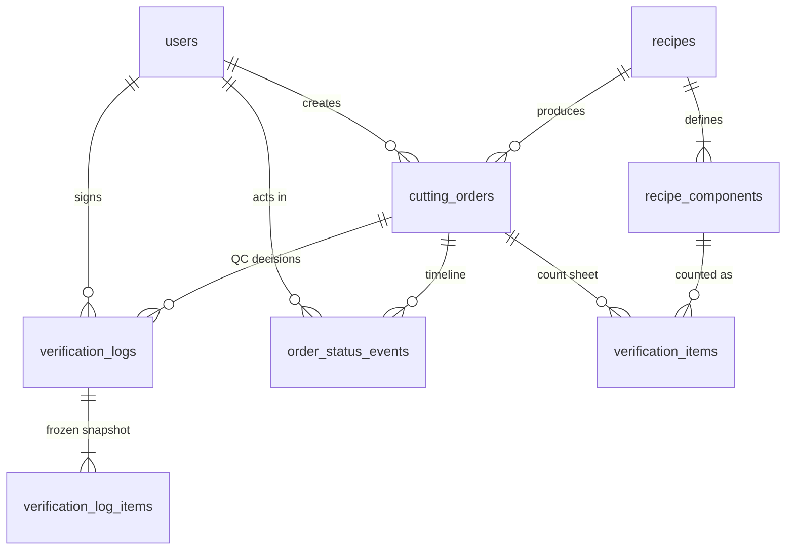

# ApparelFlow ERP — Cutting Operations & Gatekeeper Verification Terminal

A full-stack implementation of the **Production Batch Verification & Sewing Queue Gate** module of ApparelFlow ERP.
Cutting supervisors create batches from production recipes, an isolated QC verifier counts every cut component,
and a **server-enforced hard stop** guarantees that no unverified, mismatched or short batch can ever reach the
sewing floor.

| | |
| --- | --- |
| **Live application** | [Open the ApparelFlow ERP production deployment](https://apparelflow-gatekeeper.vercel.app/) |
| **Run locally** | `npm install` → `npm run db:setup` → `npm run dev`. No Docker needed — see the [quick start](#quick-start--run-locally-without-docker) |
| **Stack** | Next.js 16 (App Router) · React 19 · TypeScript · PostgreSQL · Prisma 6 · Zod 4 · Tailwind CSS 4 |
| **Tests** | 131 unit + integration tests (Vitest, real PostgreSQL) · 7 Playwright E2E journeys with axe-core WCAG 2.1 AA audits · deployment security audit (23 read-only / 33 full checks), also published as a GitHub Action |
| **Automation** | CI/CD with gated production deploys · CodeQL · Dependency Review · Dependabot + auto-merge · Copilot code review · Docker Hub & GHCR images · tag-driven releases |
| **Guides** | [Local development](./docs/local-development.md) · [API reference](./docs/api-reference.md) · [Deployment](./docs/deployment.md) · [CI/CD & GitHub automation](./docs/ci-cd.md) |
| **AI usage** | Documented candidly in [`AI_OPTIMIZATION_REPORT.md`](./AI_OPTIMIZATION_REPORT.md) |

---

## Contents

1. [Quick start — run locally without Docker](#quick-start--run-locally-without-docker)
2. [Demo credentials](#demo-credentials)
3. [Five-minute evaluator walkthrough](#five-minute-evaluator-walkthrough)
4. [Features](#features)
5. [Architecture](#architecture)
6. [Manufacturing state machine](#manufacturing-state-machine)
7. [Role-based access control](#role-based-access-control)
8. [Security model — defence in depth](#security-model--defence-in-depth)
9. [Database schema](#database-schema)
10. [Business rules](#business-rules)
11. [API](#api)
12. [Testing](#testing)
13. [Deployment, Docker & CI/CD](#deployment-docker--cicd)
14. [Project structure](#project-structure)
15. [Design decisions & assumptions](#design-decisions--assumptions)

---

## Quick start — run locally without Docker

You need **Node.js 20.19+** (24 LTS recommended, see `.nvmrc`) and a running **PostgreSQL 14+** server. That can be
a local install (Homebrew, Postgres.app, the Windows installer, apt) or a free [Neon](https://neon.tech) /
[Supabase](https://supabase.com) database.

```bash
# 1. Install dependencies (this also generates the Prisma client)
npm install

# 2. Create your environment file
cp .env.example .env
#    Then edit .env:
#    - DATABASE_URL and DIRECT_URL: your PostgreSQL connection string, for example
#        Homebrew / Postgres.app:  postgresql://<your-os-username>@localhost:5432/apparelflow?schema=public
#        Windows / Linux:          postgresql://postgres:<password>@localhost:5432/apparelflow?schema=public
#    - AUTH_SECRET: the output of  openssl rand -base64 48

# 3. Create the database (if missing), apply the migrations and load the demo data
npm run db:setup

# 4. Start the development server on http://localhost:3000
npm run dev
```

Sign in with one of the [demo personas](#demo-credentials). To run the optimized production build instead, use
`npm run build` followed by `npm run start`.

[docs/local-development.md](./docs/local-development.md) covers PostgreSQL setup on each platform, running the test
suites locally, and troubleshooting.

| Command | What it does |
| --- | --- |
| `npm run dev` | Development server with hot reload on <http://localhost:3000> |
| `npm run build` · `npm run start` | Production build · serve it |
| `npm run lint` · `npm run typecheck` | ESLint · TypeScript check (after generating Next.js route types) |
| `npm test` | Unit + integration tests (needs `TEST_DATABASE_URL`) |
| `npm run test:unit` · `npm run test:integration` · `npm run test:e2e` | One suite at a time |
| `npm run db:setup` | `db:migrate` (apply migrations, creating the database if needed) + `db:seed` (demo users, recipes and batches) |
| `npm run db:studio` | Browse the data in Prisma Studio |
| `npm run db:reset` | **Destructive:** drops, re-migrates and re-seeds the database in `DATABASE_URL`. Development only |
| `npm run audit:api -- <url>` | Deployment security audit; add `--mode=full` for the full batch lifecycle |
| `npm run docker:db` · `npm run docker:build` | Optional: PostgreSQL in Docker · build the production image |

## Demo credentials

All three are real accounts (bcrypt-hashed) created by the seed script. The sign-in page has a **Demo personas**
panel with one-click sign-in, and every workspace has a **Switch role** menu that re-authenticates through the same
login API — nothing about a role is decided in the browser.

| Persona | Role code | Email | Password |
| --- | --- | --- | --- |
| Cutting Supervisor — Nimal Fernando | `cutting_supervisor` | `supervisor@apparelflow.demo` | `ApparelFlow@2026` |
| Cutting Verifier — Amal Perera | `cutting_verifier` | `verifier@apparelflow.demo` | `ApparelFlow@2026` |
| Sewing Supervisor — Dilani Jayawardena | `sewing_supervisor` | `sewing@apparelflow.demo` | `ApparelFlow@2026` |

The seed also creates one demo batch in every pipeline state (verified, pending verification, rejected, in cutting,
in sewing), so each workspace has data immediately — while new batches can of course be created.

## Five-minute evaluator walkthrough

| Audit step | Where to look |
| --- | --- |
| **Contrast audit** | Every input, select, textarea and dialog uses ink-on-white with a visible slate-500 border and a 3 px focus ring; the app forces `color-scheme: light`. The E2E suite runs axe-core WCAG 2.1 AA scans (including `color-contrast`) on eight screens with **zero violations**. |
| **RBAC check** | Sign in as the verifier: no *New cutting order* button, and `/cutting` returns a real **HTTP 403** page. Sign in as sewing: `/verification` and `/cutting` are 403; pending/rejected batches are absent from the queue *and* from the API. |
| **Shortage hard stop** | Verifier → *QC Queue* → open `CUT-…-0002` → enter a count below expected. The row turns **RED**, *Approve batch* is disabled, and the **Enforcement check** card sends the approval to the API anyway and shows the server's **422 VERIFICATION_GATE_BLOCKED** response. |
| **Sewing hand-off** | Enter exact counts → *Approve batch* → the batch appears in the sewing supervisor's queue with verifier name, timestamp, per-component counts and wastage. Refresh — everything persists in PostgreSQL. |
| **API probing** | `npm run audit:api -- https://<deployment>` runs the attack checklist (403s, 422s, forged identity, URL tampering) and prints PASS/FAIL for each check; add `--mode=full` to also drive a batch through the whole lifecycle. cURL examples are in the [API reference](./docs/api-reference.md#curl-examples). |

## Features

**Cutting Supervisor** — order board with live status KPIs and filters; create orders from a recipe (target quantity,
fabric roll, actual fabric used) with a live **multiplier engine** preview (expected pieces per component, expected
fabric, projected wastage vs. cap); create as *in cutting* or *create & submit to QC*; edit while cutting; review
rejection reasons with the exact short components; start a re-cut and resubmit for a new QC round; full append-only
timeline per order.

**Cutting Verifier** — FIFO QC queue with count progress; the **Verification Terminal**: per-component count entry,
instant GREEN / YELLOW / RED traffic lights with variance, a gatekeeper verdict panel, disabled approval while anything
is short / missing / uncounted / invalid, an approval confirmation with an optional note for the sewing floor, a
mandatory-reason rejection dialog (with a one-click shortage summary), an in-UI probe of the server hard stop, and an
immutable decision log.

**Sewing Supervisor** — a queue that only ever contains `VERIFIED` batches, each with its approval record (verifier,
timestamp, counts, wastage, notes); *Start sewing assembly*; an *In assembly* view.

**Platform** — real authentication (bcrypt + HS256 JWT in an HttpOnly, SameSite cookie), server-side RBAC on every
route handler and page, Zod validation on every input, transactional state changes with row locking, database-level
integrity guards, consistent JSON error envelopes, security headers + production CSP, responsive layout down to
phone width, keyboard-accessible dialogs and menus.

## Architecture



* **`src/domain`** — pure, framework-free business rules: multiplier engine, traffic-light classification, the
  hard-stop gate, exact wastage arithmetic, the state machine and the RBAC matrix. The server and the UI import the
  same functions, so the UI preview can never disagree with the server — but only the server's evaluation counts.
* **`src/server`** — authentication, authorization, HTTP plumbing and the domain services. Every service receives the
  authenticated actor and re-checks its permission; identity, timestamps and statuses are never read from requests.
* **`src/app`** — Next.js routes. Pages are Server Components that call services directly; mutations go through the
  REST endpoints (visible in the network tab and testable with cURL/Postman), then refresh the server-rendered view.
* **PostgreSQL** is the source of truth and the last line of defence (see below).

## Manufacturing state machine



There is no generic "update status" endpoint. Each transition is a named action (`submit`, `approve`, `reject`,
`recut`, `start`) with a single whitelisted source status (`src/domain/state-machine.ts`). Every transition runs in a
database transaction with a row lock, uses a compare-and-set `UPDATE … WHERE status = <expected>`, and appends an
immutable status event. A PostgreSQL trigger enforces the same whitelist independently.

## Role-based access control

| Permission | Cutting Supervisor | Cutting Verifier | Sewing Supervisor |
| --- | :---: | :---: | :---: |
| Read recipes (BOM) | ✅ | ✅ | ✅ |
| Create / edit / submit cutting orders, start re-cut | ✅ | — | — |
| Read the order board | ✅ | — | — |
| Read QC queue & count sheets, record counts | — | ✅ | — |
| **Approve / reject batches** | — | ✅ | — |
| Read the Sewing Queue, start sewing | — | — | ✅ |

The matrix lives in one place (`src/domain/roles.ts`) and drives server enforcement, page guards and navigation.
Separation of duties: the supervisor can never verify, the verifier can never create orders, and the sewing floor can
never see a batch that has not been approved.

## Security model — defence in depth

| Layer | What it does | Bypassable on its own? |
| --- | --- | --- |
| UI | Hides other roles' actions, disables *Approve* while the gate is red, inline validation | Yes — convenience only |
| `proxy.ts` | Redirects anonymous visitors to the login page | Yes — UX only |
| Route handlers | **401** unauthenticated → **403** wrong role → **422** invalid input, in that order; same-origin check on unsafe methods | No |
| Server Components | Re-authenticate and call `forbidden()` (real HTTP 403) for the wrong role | No |
| Domain services | Re-check permission, lock the order row, validate the transition (**409**), evaluate the hard-stop gate (**422**), write the audit record and the status change in **one transaction** | No |
| PostgreSQL | CHECK constraints, state-machine trigger, hard-stop trigger, append-only audit triggers, count-sheet lock, FK `RESTRICT` | No — holds even against direct SQL |

Concretely:

* **Authenticated context.** The verifier recorded on an approval is the session user re-loaded from the database;
  the timestamp is set by the server/database. Request bodies are validated with strict schemas, so smuggled fields
  such as `status`, `verifierId` or `timestamp` are rejected with 422 rather than silently ignored.
* **Server-side hard stop.** `approveBatch()` (`src/server/services/verification.ts`) evaluates the gate inside the
  approval transaction from the *persisted* counts, measured against the *recipe* (target × pieces per garment) — not
  against anything the client sends, and not against the stored expectation alone.
* **Query isolation.** `GET /api/sewing/queue` filters `WHERE status = 'VERIFIED'` in the database query; query
  parameters are ignored. Direct lookups of unverified batches return 404 so their existence is not disclosed.
* **Database guards** (`prisma/migrations/20261004120200_integrity_guards`): an order can only become `VERIFIED` if
  every recipe component has a counted, non-short count-sheet entry **and** an `APPROVED` verification record exists
  for the current QC round; verification logs, their component snapshots and status events are append-only; a stored
  traffic light can never contradict its count; batch details and count sheets are locked once they leave their stage.
* **Sessions.** HS256 JWT (jose) in an `HttpOnly`, `SameSite=Lax`, `Secure` (on HTTPS) cookie, 8-hour shift lifetime.
  The user and role are re-loaded on every request, so deleting a user or changing a role invalidates tokens at once.
  Unknown-email logins spend the same bcrypt time as wrong passwords.
* **Headers.** `X-Frame-Options: DENY`, `nosniff`, `Referrer-Policy`, `Permissions-Policy`, and in production a
  Content-Security-Policy and HSTS (`next.config.ts`).

## Database schema



| Table | Key columns | Notes |
| --- | --- | --- |
| `users` | `id`, `email` (unique), `password_hash`, `role` (enum), `full_name`, `created_at` | Roles: `CUTTING_SUPERVISOR`, `CUTTING_VERIFIER`, `SEWING_SUPERVISOR` |
| `recipes` | `id`, `recipe_code` (unique), `name`, `category`, `std_fabric_yards` `DECIMAL(8,3)`, `wastage_cap` `DECIMAL(5,2)` | Seeded: REC-BL01 Casual Blouse, REC-CT02 Crop Top |
| `recipe_components` | `id`, `recipe_id`, `component_name`, `pieces_per_garment`, `image_url`, `sort_order` | Unique per recipe; `pieces_per_garment > 0` |
| `cutting_orders` | `id`, `order_no` (DB sequence `CUT-YYYY-NNNN`), `recipe_id`, `target_qty`, `fabric_roll_id`, `actual_fabric_yds`, `status`, `verification_round`, `created_by`, `submitted_at`, `verified_at`, `sewing_started_at/by`, timestamps | State machine enforced by trigger |
| `verification_items` | `id`, `order_id`, `component_id`, `expected_qty`, `actual_qty` (NULL = uncounted), `status` (GREEN/YELLOW/RED), `counted_by/at` | Live count sheet of the current QC round; CHECK ties `status` to the counts |
| `verification_logs` | `id`, `order_id`, `verifier_id`, `decision` (APPROVED/REJECTED), `round`, `rejection_category`, `rejection_note`, `approval_note`, `wastage_pct`, `wastage_cap`, `expected_fabric_yds`, `actual_fabric_yds`, `target_qty`, `timestamp` | Append-only; one decision per order per round |
| `verification_log_items` | `log_id`, `component_id`, `component_name`, `pieces_per_garment`, `expected_qty`, `actual_qty`, `variance`, `status` | Immutable per-component snapshot taken with each decision |
| `order_status_events` | `id`, `order_id`, `from_status`, `to_status`, `actor_id`, `note`, `created_at` | Append-only timeline |

Migrations live in `prisma/migrations` (sequence → tables → integrity guards); `prisma migrate diff` against the
schema reports no drift.

## Business rules

| Rule | Implementation |
| --- | --- |
| **Multiplier engine** — expected pieces = target quantity × pieces per garment | `src/domain/production.ts` |
| **Traffic lights** — GREEN `actual = expected`, YELLOW `actual > expected` (may proceed), RED `actual < expected` (blocks) | `src/domain/traffic-light.ts`, recomputed server-side on every count |
| **Hard stop** — approval requires every recipe component present, counted, and not short | `src/domain/gate.ts`, enforced in `approveBatch()` and by a database trigger |
| **Wastage** — `[(actual fabric − expected fabric) ÷ expected fabric] × 100`, expected fabric = target × standard yards | `src/domain/wastage.ts` — exact scaled-integer (BigInt) arithmetic, rounded half away from zero to 2 dp, stored with every decision |
| **Rejection** — mandatory reason (≥ 10 characters) and a category; returns the batch to the supervisor | `rejectBatchSchema`, `rejectBatch()`, CHECK constraint |
| **Input guards** — quantities and counts are whole numbers; negatives, decimals, numeric strings, `null`, blanks and empty bodies are rejected with field-level messages | `src/domain/validation.ts` (shared by forms and API) |

## API

REST endpoints under `/api`, authenticated by the `af_session` HttpOnly cookie that `POST /api/auth/login` sets.
Every response uses one envelope:

```jsonc
{ "success": true,  "data": { /* … */ } }
{ "success": false, "error": { "code": "VERIFICATION_GATE_BLOCKED", "message": "…", "details": { /* … */ } } }
```

Status codes: **400** malformed JSON · **401** not signed in · **403** role not permitted / cross-origin ·
**404** not found or not visible to the role · **409** illegal state transition or concurrent change ·
**422** validation failure or business-rule violation (the hard stop) · **500** unexpected (details are logged, never returned).

| Area | Endpoints | Role |
| --- | --- | --- |
| Auth & health | `POST /api/auth/login`, `POST /api/auth/logout`, `GET /api/auth/me`, `GET /api/health` | public / signed-in |
| Recipes | `GET /api/recipes`, `GET /api/recipes/:id` | all roles |
| Cutting orders | `GET`/`POST /api/cutting-orders`, `GET`/`PATCH /api/cutting-orders/:id`, `POST …/:id/submit`, `POST …/:id/recut` | Cutting Supervisor |
| Verification | `GET /api/verifications/pending`, `GET …/history`, `GET …/:orderId`, `PUT …/:orderId/items`, `POST …/:orderId/approve`, `POST …/:orderId/reject` | Cutting Verifier |
| Sewing | `GET /api/sewing/queue`, `GET /api/sewing/assembly`, `GET …/queue/:orderId`, `POST …/queue/:orderId/start` | Sewing Supervisor |

The [API reference](./docs/api-reference.md) has every endpoint with its request body, plus ready-to-run cURL
examples for the 403, 422 and 404 checks.

## Testing

| Suite | Command | What it covers |
| --- | --- | --- |
| Unit (75) | `npm run test:unit` | Multiplier engine, traffic lights, hard-stop gate, exact wastage arithmetic, state-machine whitelist, RBAC matrix, input parsing edge cases (`-1`, `0`, `1.5`, `"50"`, `"abc"`, `" "`, `null`, `1e3` …) |
| Integration (56) | `npm run test:integration` | Real route handlers + services + PostgreSQL (migrations and triggers included): authentication, RBAC on every mutation, validation, the hard stop, rejection, re-cut loop, sewing isolation, concurrency (three simultaneous approvals → exactly one succeeds), and database guards against direct writes |
| Both | `npm test` | Unit + integration (needs `TEST_DATABASE_URL`) |
| End-to-end (7) | `npm run test:e2e` | The evaluator's audit in a real browser against a production build, with axe-core WCAG 2.1 AA scans on eight screens (run `npx playwright install chromium` once first) |
| Deployment audit (23 read-only / 33 full checks) | `npm run audit:api -- <url> [--mode=full]` | The API attack checklist against any running deployment; the same script is the `ApparelFlow Gatekeeper Audit` action |

The five tests required by the brief are in `tests/integration/verification-gate.test.ts`, named exactly as specified:

1. **Test 1** — an order with all GREEN components can be approved by an authenticated Verifier (also asserts session-derived attribution, server timestamp and the 2.22 % wastage).
2. **Test 2** — one RED component blocks approval with **422**; nothing is written and the batch is absent from the Sewing Queue.
3. **Test 3** — rejection without a reason (missing, empty, whitespace, too short, wrong type, empty body) is rejected by backend validation.
4. **Test 4** — Cutting Supervisor and Sewing Supervisor receive **403** for approve, reject and count; anonymous requests receive 401.
5. **Test 5** — in-cutting, pending and rejected orders never appear in the Sewing Queue query — via the service, the API, and with tampered query parameters — and direct lookups return 404.

**How the integration suite isolates data:** a global setup migrates and seeds a *template* database once; each test
file then clones it (`CREATE DATABASE … TEMPLATE`) in milliseconds and drops it afterwards, so files run in parallel
against a real PostgreSQL with all triggers active. The E2E run likewise creates its own uniquely named database and
drops only that one — no test ever resets an existing database. Running the suites locally is covered in
[docs/local-development.md](./docs/local-development.md#running-the-tests-locally).

## Deployment, Docker & CI/CD

* **Production — Vercel + Neon / Supabase.** Deployments run from GitHub Actions after the CI/CD pipeline is green on
  `main`: **migrate → build → deploy → smoke-test**, so database migrations only ever run from a verified commit.
  `vercel.json` turns off Vercel's own automatic production deployments. Setup steps are in
  [docs/deployment.md](./docs/deployment.md).
* **Docker image.** `docker/Dockerfile` builds a multi-stage, non-root image of the Next.js standalone server (plus an
  optional `migrator` target). GitHub Actions publishes it to Docker Hub and GitHub Packages (GHCR): versioned
  multi-arch (amd64 + arm64) images for each release, and an `edge` image for every push to `main`:
  ```bash
  docker run -p 3000:3000 -e DATABASE_URL="postgresql://…" -e AUTH_SECRET="$(openssl rand -base64 48)" \
    <dockerhub-user>/apparelflow-erp:latest          # or ghcr.io/<owner>/apparelflow-erp:latest
  ```
  Build it locally with `npm run docker:build`. Docker is only needed for the image; the app itself runs without it.
* **GitHub automation.** CI/CD pipeline (lint, typecheck, unit, integration, E2E, container audit), gated production
  deploys, CodeQL, Dependency Review, Dependabot with auto-merge, Copilot code review, tag-driven releases, image
  publishing, and the `ApparelFlow Gatekeeper Audit` Marketplace action (`action.yml`). The workflow map, required
  secrets, repository settings and release process are in [docs/ci-cd.md](./docs/ci-cd.md).

## Project structure

```text
.
├── src/
│   ├── app/
│   │   ├── (workspace)/          authenticated workspaces (shared shell)
│   │   │   ├── cutting/          order board + order detail          — Cutting Supervisor
│   │   │   ├── verification/     QC queue, terminal, decision log    — Cutting Verifier
│   │   │   ├── sewing/           sewing queue + batch audit record   — Sewing Supervisor
│   │   │   └── recipes/          read-only recipe library            — all roles
│   │   ├── api/                  REST route handlers (auth, recipes, cutting-orders, verifications, sewing, health)
│   │   └── login/  forbidden.tsx  not-found.tsx  error.tsx  global-error.tsx
│   ├── components/               UI kit (ui/), layout shell, orders, verification, sewing, auth
│   ├── domain/                   pure business rules shared by server and UI
│   ├── lib/                      DTO contracts, API client, formatters, demo accounts
│   ├── server/
│   │   ├── auth/                 sessions (jose), passwords (bcrypt), current user, page guards
│   │   ├── http/                 errors, response envelope, request parsing, route wrapper
│   │   └── services/             cutting orders, verification (hard stop), sewing, recipes, auth
│   └── proxy.ts                  anonymous-visitor redirect (UX only)
├── prisma/                       schema.prisma, migrations/, seed.ts, seed-data.ts
├── tests/
│   ├── unit/  integration/       Vitest suites
│   ├── e2e/                      Playwright journeys + playwright.config.ts
│   ├── helpers/  setup/          fixtures, request helpers, test-database lifecycle
│   └── vitest.workspace.ts       unit + integration project definitions
├── docs/                         local development, API reference, deployment, CI/CD guides
├── docker/
│   ├── Dockerfile                multi-stage production image (+ optional migrator target)
│   ├── Dockerfile.dockerignore   build-context filter for that Dockerfile
│   └── compose.yaml              optional local PostgreSQL (npm run docker:db)
├── scripts/audit-api.mjs         deployment security audit (read-only / full)
├── public/                       static assets
├── .github/
│   ├── workflows/                CI/CD, deploy, CodeQL, dependency review, Dependabot auto-merge,
│   │                             Copilot review, release, Docker Hub, GHCR, Marketplace
│   └── dependabot.yml  copilot-instructions.md  release.yml  codeql/  dependency-review-config.yml
├── action.yml                    "ApparelFlow Gatekeeper Audit" GitHub Action (Marketplace)
├── AI_OPTIMIZATION_REPORT.md     AI usage report
└── package.json, configs         see below
```

The files left at the root are the ones tools look for there: `package.json` and `package-lock.json` (npm),
`next.config.ts` and `next-env.d.ts` (Next.js), `tsconfig.json` (TypeScript), `eslint.config.mjs` (ESLint),
`postcss.config.mjs` (Tailwind CSS), `prisma.config.ts` (Prisma CLI), `vitest.config.ts` (the Vitest entry point that
editors discover; the suites live in `tests/vitest.workspace.ts`), `vercel.json` (Vercel), `.nvmrc` (Node.js
version), `.env.example`, and `action.yml` (GitHub Marketplace requires it at the root).

## Design decisions & assumptions

* **Fabric is a measurement, pieces are counts.** Batch quantities and piece counts must be whole numbers; fabric
  yards accept up to two decimals (e.g. `92.50`) because the standard consumption itself is fractional (1.8 yd).
  Zero is a legitimate physical count (it is RED); negatives are not.
* **The wastage cap is a warning, not a gate.** The brief stores the cap on the recipe and the wastage on the record
  but does not make the cap a hard stop, so exceeding it is flagged in the UI and the audit record without blocking
  approval.
* **409 vs 422.** Acting on a batch in the wrong state (approving twice, approving a batch still in cutting) is a
  **409** state conflict; a pending batch that is short, missing a component or uncounted is the **422** hard stop.
* **Sewing sees 404, not 403, for unverified batches** so the existence of pending or rejected work is not disclosed.
* **Re-cut loop.** A rejection keeps its count snapshot forever; *Start re-cut* returns the batch to cutting, where
  fabric can be updated; resubmission opens a new QC round with a fresh count sheet.
* **Order numbers** come from a PostgreSQL sequence (`CUT-YYYY-NNNN`). Sequences are non-transactional, so numbers
  can have gaps after failed inserts — normal for ERP document numbering.
* **Times** are stored in UTC (`timestamptz`) and displayed in the plant time zone (`Asia/Colombo` by default).
* **Out of scope / future work:** user administration, recipe editing, login rate limiting (needs a shared store such
  as Redis on serverless), per-session revocation lists, internationalisation.
