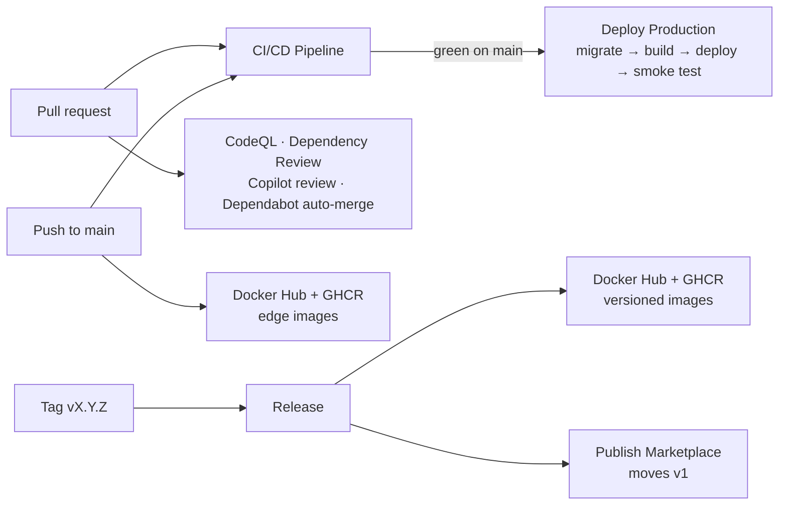

# CI/CD & GitHub automation

Everything is defined in [`.github/`](../.github): ten workflows plus the Dependabot, CodeQL, dependency-review,
release-notes and Copilot configuration they use.

- [How the workflows fit together](#how-the-workflows-fit-together)
- [Workflows](#workflows)
- [Secrets & variables](#secrets--variables)
- [Repository settings](#repository-settings)
- [Cutting a release](#cutting-a-release)
- [Using the gatekeeper audit action](#using-the-gatekeeper-audit-action)

## How the workflows fit together



## Workflows

| Workflow | File | Runs on | What it does |
| --- | --- | --- | --- |
| **CI/CD Pipeline** | `ci-cd.yml` | pull requests, pushes to `main`, manual | Lint + typecheck; unit + integration tests on PostgreSQL; Playwright E2E with axe-core; builds the Docker image from `docker/Dockerfile`, runs it and audits it with the gatekeeper action (full mode). On `main`, a green run calls **Deploy Production**. |
| **Deploy Production** | `deploy-production.yml` | called by CI/CD on `main`, manual | `prisma migrate deploy` → `vercel build` → `vercel deploy --prebuilt --prod` → read-only gatekeeper audit of `PRODUCTION_URL`. Uses the `production` environment (add required reviewers there for manual approval). |
| **CodeQL Security Analysis** | `codeql.yml` | PRs, `main`, weekly | `security-extended` analysis of the TypeScript code and of the workflows themselves. |
| **Dependency Review** | `dependency-review.yml` | pull requests | Fails PRs that add moderate+ vulnerabilities or licenses outside `.github/dependency-review-config.yml`. |
| **Dependabot updates** | `.github/dependabot.yml` | weekly | npm (grouped minor/patch), GitHub Actions (SHA pins) and the Docker base image in `docker/Dockerfile`, with a release cooldown. |
| **Dependabot Auto-merge** | `dependabot-auto-merge.yml` | Dependabot PRs | Approves and auto-merges (squash) patch/minor updates once required checks pass; comments on majors. |
| **Copilot Code Review** | `copilot-code-review.yml` | non-draft PRs | Requests a GitHub Copilot review guided by `.github/copilot-instructions.md`. |
| **Release** | `release.yml` | `vX.Y.Z` tags, manual | Verifies the tag matches `package.json`, re-runs the checks, creates the GitHub Release (notes grouped by `.github/release.yml`) and publishes the images and the action. |
| **Publish Images to Docker Hub** | `publish-dockerhub.yml` | `main`, releases, manual | Image with SBOM + provenance → `docker.io/<user>/apparelflow-erp`: `edge` + `sha-<commit>` (amd64) from `main`; `X.Y.Z`, `X.Y`, `X`, `latest` (amd64 + arm64) from releases. |
| **Publish to GitHub Packages** | `publish-ghcr.yml` | `main`, releases, manual | Same image and tags → `ghcr.io/<owner>/apparelflow-erp`, plus a signed build-provenance attestation. |
| **Publish Marketplace** | `publish-marketplace.yml` | releases, manual | Validates `action.yml` and moves the floating major tag (`v1`). |

Every third-party action is pinned to a full commit SHA (Dependabot keeps the pins current), workflows default to
read-only permissions, and untrusted event data never reaches a shell without going through `env:`.

## Secrets & variables

Add these under **Settings → Secrets and variables → Actions**.

| Name | Kind | Used by |
| --- | --- | --- |
| `DOCKERHUB_USERNAME` | secret (or variable) | Publish Images to Docker Hub |
| `DOCKERHUB_TOKEN` | secret — a Docker Hub access token (Read & Write) is recommended; a password also works | Publish Images to Docker Hub |
| `VERCEL_TOKEN`, `VERCEL_ORG_ID`, `VERCEL_PROJECT_ID` | secrets | Deploy Production |
| `PRODUCTION_DIRECT_URL` | secret — direct PostgreSQL URL | Deploy Production (migrations) |
| `PRODUCTION_URL` | variable | Deploy Production (smoke test) |
| `COPILOT_REVIEW_TOKEN` | optional secret | Copilot Code Review, if the built-in token cannot request Copilot |

GHCR publishing uses the built-in `GITHUB_TOKEN`. Workflows whose secrets are missing skip with a warning instead of
failing, so the pipeline stays green until each integration is configured.

## Repository settings

* **Settings → General:** enable *Allow auto-merge*.
* **Settings → Actions → General:** enable *Allow GitHub Actions to create and approve pull requests* (Dependabot approvals).
* **Settings → Rules → Rulesets:** protect `main` — require the *CI/CD Pipeline* jobs, *Dependency Review* and
  *CodeQL* checks; optionally enable *Automatically request Copilot code review*.
* **Settings → Code security:** enable Dependabot alerts and security updates; leave CodeQL *default setup* off
  (the advanced `codeql.yml` replaces it).
* **Settings → Environments:** the `production` environment is created on the first deployment; add required
  reviewers there if production deployments should wait for approval.

## Cutting a release

```bash
npm version 1.1.0 --no-git-tag-version
git commit -am "chore(release): v1.1.0"
git tag v1.1.0
git push origin main v1.1.0
```

The Release workflow publishes `1.1.0`, `1.1`, `1` and `latest` image tags to Docker Hub and GHCR (amd64 + arm64)
and points `v1` of the action at the release. Tags with a suffix (`v1.2.0-rc.1`) become pre-releases without
`latest`/major tags.

## Using the gatekeeper audit action

The root [`action.yml`](../action.yml) publishes `scripts/audit-api.mjs` as the **ApparelFlow Gatekeeper Audit**
action. It checks a running deployment for RBAC 403s, the 422 verification hard stop, forged identity and Sewing
Queue isolation.

```yaml
- uses: <owner>/<repo>@v1   # this repository
  with:
    base-url: https://apparelflow.example.com
    mode: read-only        # or "full" (creates a demo batch)
```

| Input | Default | Purpose |
| --- | --- | --- |
| `base-url` | — (required) | Deployment to audit |
| `mode` | `read-only` | `read-only` is safe on production; `full` also drives a batch through the whole lifecycle |
| `wait-seconds` | `60` | How long to wait for `/api/health` to report the database as up |
| `password`, `supervisor-email`, `verifier-email`, `sewing-email` | demo accounts | Personas used by the audit — pass secrets for non-demo deployments |
| `node-version` | `24` | Node.js version used to run the audit |

Outputs: `passed`, `failed` and `skipped` check counts.

GitHub requires the action metadata at the repository root, which is why `action.yml` lives there. To list it on
the GitHub Marketplace, edit the first release and tick *Publish this Action to the GitHub Marketplace* (a one-time
manual step — GitHub has no API for it).
